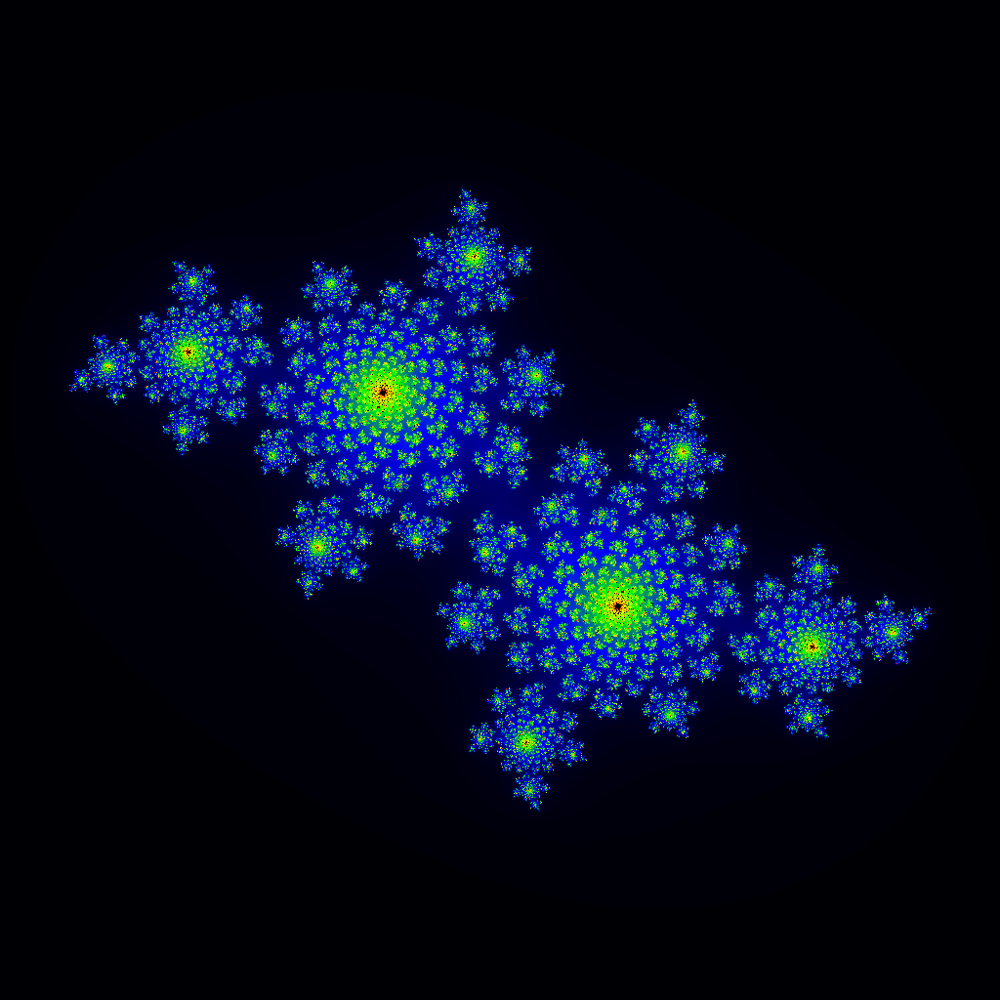

# Openlab GPU Lecture Hands on

[![CC BY-SA 4.0][cc-by-sa-shield]][cc-by-sa] Stephan Hageboeck, CERN

This repository contains CUDA exercises for CERN Openlab's GPU lecture. There's two methods to work on these exercises:

## Setup

### Method 1: SSH / local machine
- Find a computer with a GPU. At CERN, you can e.g. use
  - `ssh -X lxplus-gpu.cern.ch`
  for access to shared GPUs.
- Clone the following repository: `git clone https://github.com/hageboeck/OpenlabLecture.git`
- `cd OpenlabLecture/source`
- Use a terminal-based editor such as vim, nano, emacs to edit the files or try graphical editors like geany etc if you have an X client on your computer.
- To compile the executables:
    - Try it manually using `nvcc -O2 -g -std=c++17 <filename>.cu -o <executable>`.
    - Use the Makefile, e.g. `make helloWord` for only one executable or `make` to compile all in one go.


### Method 2: GPU-enabled SWAN session (limited number of slots)
- If you don't have a cernbox account yet, go to [cernbox.cern.ch](https://cernbox.cern.ch)
- Go to [swan.cern.ch](https://swan.cern.ch), choose jupyterlab, LCG105 CUDA, start the session
- On the left, find the button to clone a git repository, and clone:
  `https://github.com/hageboeck/OpenlabLecture.git`
- Now you have two choices:
  1. Write CUDA in notebooks:
     - Use [FirstSteps notebook](FirstSteps.ipynb) for the first two tasks.
     - Finally, go to [Julia notebook](Julia.ipynb) for the third task.
  2. Go to `source/` and work directly with the files. Open a terminal to compile and run the programs.


----


## Exercise 1: Hello world example
[helloWorld.cu](source/helloWorld.cu)
Here we have a very basic helloWorld program that prints a message from the host.

Your tasks:
1. Convert the HelloWorld function to a kernel, and call it from `main()`.
1. In the kernel, fill in the variables that print thread index and block index.
1. Try a few launch configurations with more threads / more blocks.

## Exercise 2: vectorAdd example
[vectorAdd.cu](source/vectorAdd.cu)
In this example, we add two arrays on the host and on the device. We use timers to measure the execution speed.

Your tasks:
1. Implement an efficient grid-strided loop. Currently, every thread steps through every item.
1. Find an efficient launch configuration to fully use the device.


## Exercise 3: Computing a Julia set
[julia.cu](source/julia.cu)
We compute the Julia and Fatou sets in the complex plane. This requires evaluating a quadratic complex polynomial for more than a million pixels in the complex plane. This is a perfect job for a GPU.

Your tasks:
1. In the `main()` function, allocate memory for all pixels. The writePPM function expects an array of pixels in the form `{y0={x0 x1 x2 x3 ...}, y1={x0 x1 x2 x3 ...}, ... y_n }`, so allocate a one-dimensional array with enough memory for `x*y` pixels. There's already a section that checks for possible cuda errors, so allocate the memory just before that section. Don't forget to free the memory when you're done.
1. Launch the draft kernel from the main function. Check for possible errors.
1. Figure out a way to compute the pixel indices `i` and `j` from `threadIdx.x` and `blockIdx.x`. Find a kernel launch configuration that covers the entire image.
1. Implement the computation `z = z^2 + c`.
    - We will not use any external complex number classes for this, so square the complex number by hand.
    - Plug the computation in the loop. Check that it runs
        - for a maximum of `maxIter` times
        - or until z starts to diverge (`|z| >= maxMagnitude`).
    - Record at which iteration z diverged in the pixel array. There's already a line of code that should take care of this, but ensure that your iteration counter ends up in that array.
    - Note: We use 256 colours to colour the resulting image. We scale `k` into the range `[1, 256]` for best contrast, but it's not strictly necessary.
1. Check if you can generate a Julia image like this example
   

You can set the real and imaginary part for `c` as command-line arguments:
```
./julia <realPart> <imaginaryPart>
```

Try for example:
- `./julia -0.4 0.6`
- `./julia 0.285 -0.01`

To display the image, we have two options:
- The image gets exported as png if boost GIL and libpng are available. The Makefile is not very smart in detecting those, so you might have to improvise a bit.
- The image is also exported as PPM, a very simple text-based image format. You can use imagemagick's `display` to view it:
```
display julia.ppm
```
If `display` doesn't work, check that you have an ssh connection with X forwarding (`ssh -X ...`). You can also use `convert` to convert from ppm to something else.

## Bonus tasks
### Floating-point precision
The draft Julia kernel was using double precision for the complex numbers. Check if the usage of single-precision floating-point numbers yields satisfying results, and check the impact on the kernel execution. How fast can we go? (Note: Check what type of GPU the kernel is running on. Is it a data-centre grade GPU?)

### CPU equivalent
There is a naive CPU kernel called `juliaCPU` in `julia.h` that can be used as a drop-in replacement for the GPU kernel. Check its speed. How much speed up against a single CPU thread can you reach with the GPU?

### Grid-strided loops for an image of arbitrary size
You might have written a kernel where `i = threadIdx.x`. Whereas this is sufficient for our problem size, the maximum number of threads per SM is 1024, so your kernel might not be able to deal with larger images. Remember that you can use the grid-strided loop to process an array of arbitray size. Try using a grid-strided loop on an image of 2048x2048 pixels. You can use a linearised index from 0 to 2048x2048, and compute i and j using modulus and integer division.


This work is licensed under a
[Creative Commons Attribution-ShareAlike 4.0 International License][cc-by-sa].

[![CC BY-SA 4.0][cc-by-sa-image]][cc-by-sa]

[cc-by-sa]: http://creativecommons.org/licenses/by-sa/4.0/
[cc-by-sa-image]: https://licensebuttons.net/l/by-sa/4.0/88x31.png
[cc-by-sa-shield]: https://img.shields.io/badge/License-CC%20BY--SA%204.0-lightgrey.svg
